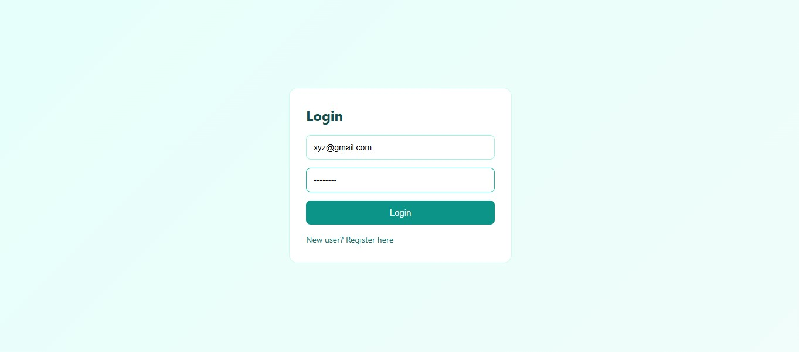
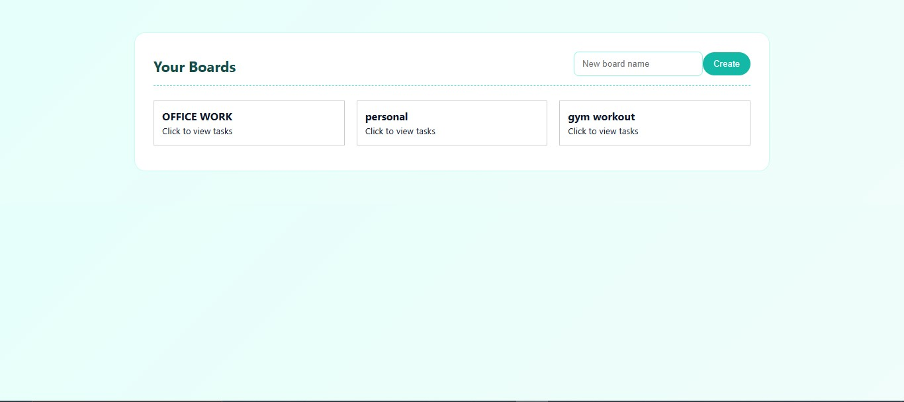
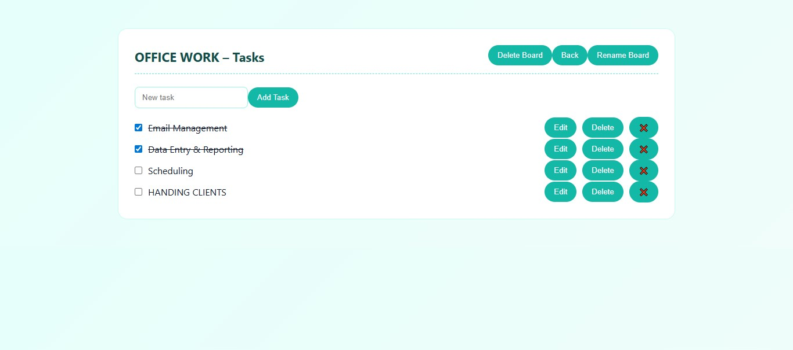

# 📝 Task Management Application (Full Stack)

A full-stack task management application where users can create boards and manage tasks efficiently.  
The project is built using **React** for the frontend and **Flask** for the backend, with secure authentication and persistent data storage.

---

## 🚀 Features

### 🔐 Authentication
- User registration and login using JWT
- Secure password hashing and token-based authentication

### 📋 Boards
- Create boards
- View all boards created by the logged-in user
- Rename boards (update board title)
- Delete boards along with related tasks

### 📝 Tasks (Todos)
- Add tasks to a board
- View tasks board-wise
- Edit task titles (update)
- Mark tasks as completed
- Delete tasks

---

## 🧱 Tech Stack

### Frontend
- React
- JavaScript
- CSS

### Backend
- Flask
- Flask-JWT-Extended
- Flask-CORS

### Database
- MongoDB (PyMongo)

---

## 🗂️ Project Structure

```
frontend/
 ├─ src/
 │  ├─ screens/        # Login, Dashboard
 │  ├─ ui/             # BoardCard, TodoRow
 │  ├─ services/       # API service
 │  └─ index.css       # Global styles

backend/
 ├─ auth/              # Authentication routes
 ├─ boards/            # Board APIs
 ├─ todos/             # Todo APIs
 ├─ database.py        # MongoDB connection
 └─ app.py             # Flask entry point
```

---

## 🔑 Authentication Approach

The application uses **JWT (JSON Web Tokens)** for authentication instead of third-party services like Firebase.

**Why JWT?**
- Stateless and secure
- Suitable for REST APIs
- Full control over authentication logic
- Keeps frontend and backend decoupled

---

## 📦 CRUD Operations

### Boards
- Create board
- Read boards
- Delete board

### Tasks
- Create task
- Read tasks
- Update task (toggle completed status)
- Delete task

---

## 🧪 Security & Validation
- All APIs are protected using JWT
- User-specific data isolation
- Validation for empty inputs
- Safe handling of invalid IDs

---

## ▶️ How to Run the Project

### Backend
```bash
cd backend
python app.py
```

Backend runs on:
```
http://localhost:5000
```

### Frontend
```bash
cd frontend
npm install
npm start
```

Frontend runs on:
```
http://localhost:3000
```

---

## 🧠 Key Highlights
- Full-stack architecture
- Secure authentication using JWT
- MongoDB for persistent storage
- Clean and user-friendly UI
- No hardcoded data
- REST-based API design

## 📸 Screenshots

### Login


### Dashboard


### Tasks


---


## 📌 Conclusion
This project demonstrates a complete full-stack workflow including authentication, API development, database integration, and frontend state management using modern web development practices.

